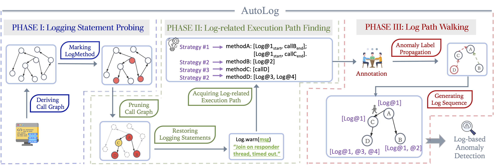

# README

This is the anonymized repository of  **AutoLog.**

The repository consists of multiple folders. The folder `/src` includes partial source code to **prove the functionality** of this project, we will fully release AutoLog after the paper is accepted. The folder `/data` contains the generated demo data from AutoLog. The folder `/scripts` contain some useful scripts. The folder `/third-party` includes two open-source program analysis tools we adpated in this project. The folder `/build` contains some builded artifacts.

### Generated Datasets

The demo datasets are shown in the data folder.

For more data, you can get it from: [AutoLogData](https://drive.google.com/drive/folders/197rHozOtNgM6ZzSVLKJ2Kd9sXvAlb3Uo?usp=sharing) & [Pupolar50](https://github.com/ICSE2023AutoLog/ICSE2023AutoLog/tree/main/data)

### Execution

You can play with this analysis framwork with multiple ways.

* `LogStatGen.jar`: fetch and restore log statements from analyzed artifacts for preliminary labelling.
* `LogEPGen.jar`: acquire log-related execution paths.
* `javacg.jar`: generate call graph from java project.
* `log_methods_generator.py`: a simple way to generate pruned call graphs.
* `AutoLog_generator.py`: log path walking.
